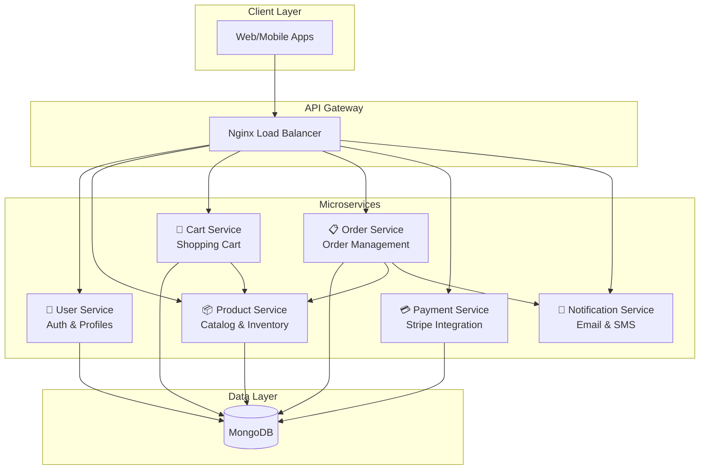

# 🛒 CartFlow — Scalable E-commerce Microservices Platform

[](https://github.com/abhisek343/cartflow/actions)
[](https://www.typescriptlang.org/)
[](https://nodejs.org/)
[](https://opensource.org/licenses/MIT)

> **The Problem:** Building a scalable, secure e-commerce backend from scratch takes months. Most tutorials show toy examples that don't work in production.

> **The Solution:** CartFlow is a **production-ready microservices architecture** that handles real e-commerce challenges: authentication, payments, inventory management, and notifications — all with proper security, validation, and testing.

---

## ⚡ Why CartFlow?

| Challenge | How CartFlow Solves It |
|-----------|------------------------|
| 🔐 **Security** | JWT auth, Argon2 hashing, Helmet headers, rate limiting |
| 📦 **Scalability** | Independent microservices, Docker ready, load balanced |
| ✅ **Reliability** | Zod validation, custom error handling, 70%+ test coverage |
| 💳 **Payments** | Stripe integration out of the box |
| 📬 **Notifications** | Email (Nodemailer) + SMS (Twilio) ready |
| 🚀 **DevOps** | CI/CD pipeline, health checks, structured logging |

---

## 🏗️ Architecture



---

## 🚀 Quick Start

### One Command Setup

```bash
# Clone and run
git clone https://github.com/abhisek343/cartflow.git
cd cartflow
docker compose up --build
```

Access the API at `http://localhost:80`

### API Endpoints

| Service | Port | Base URL | Health Check |
|---------|------|----------|--------------|
| User | 5000 | `/api/users` | `/health` |
| Product | 5001 | `/api/products` | `/health` |
| Order | 5002 | `/api/orders` | `/health` |
| Payment | 5003 | `/api/payments` | `/health` |
| Cart | 5004 | `/api/cart` | `/health` |
| Notification | 5005 | `/api/notifications` | `/health` |

---

## 🛠️ Tech Stack

| Layer | Technologies |
|-------|-------------|
| **Runtime** | Node.js 18+, TypeScript 5 |
| **Framework** | Express.js 4.19 |
| **Database** | MongoDB + Mongoose ODM |
| **Auth** | JWT + Argon2 password hashing |
| **Validation** | Zod schema validation |
| **Security** | Helmet, CORS, express-rate-limit |
| **Payments** | Stripe API |
| **Notifications** | Nodemailer + Twilio |
| **Testing** | Jest + Supertest (78% coverage) |
| **CI/CD** | GitHub Actions |
| **Container** | Docker + Docker Compose |

---

## 📁 Project Structure

```
cartflow/
├── user-service/           # Authentication & user management
├── product-service/        # Product catalog & inventory
├── shopping-cart-service/  # Shopping cart operations
├── order-service/          # Order processing & history
├── payment-service/        # Stripe payment integration
├── notification-service/   # Email & SMS notifications
├── .github/workflows/      # CI/CD pipelines
├── docker-compose.yml      # Container orchestration
├── nginx.conf              # API Gateway config
└── README.md
```

Each service follows clean architecture:
```
service/src/
├── middleware/     # Auth, validation, error handling
├── validators/     # Zod schemas
├── models/         # MongoDB models
├── routes/         # API endpoints
└── index.ts        # Entry point
```

---

## 🧪 Testing

```bash
# Run user service tests
cd user-service && npm test

# Run product service tests
cd product-service && npm test
```

**Current Coverage:**
- User Service: 78% statements, 14 tests
- Product Service: 66% statements, 10 tests

---

## 🔧 Environment Variables

Create `.env` files in each service directory:

```bash
# Common
NODE_ENV=production
JWT_SECRET=your-super-secret-key

# User Service
MONGO_URI=mongodb://localhost:27017/cartflow_users

# Payment Service
STRIPE_SECRET_KEY=sk_test_...

# Notification Service
NODEMAILER_EMAIL=your-email@gmail.com
NODEMAILER_PASSWORD=your-app-password
TWILIO_ACCOUNT_SID=...
TWILIO_AUTH_TOKEN=...
```

---

## 🤝 Contributing

See [CONTRIBUTING.md](CONTRIBUTING.md) for development guidelines.

## 📄 License

MIT License - see [LICENSE](LICENSE) for details.

---

<div align="center">

**Built with ❤️ to demonstrate production-grade Node.js microservices**

[⭐ Star this repo](https://github.com/abhisek343/cartflow) if you find it useful!

</div>
